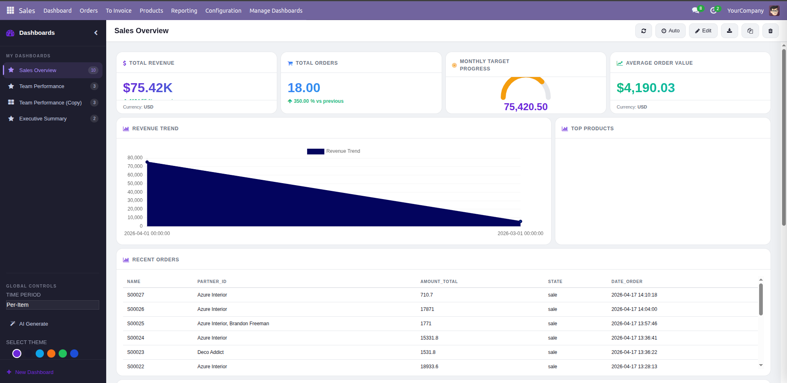
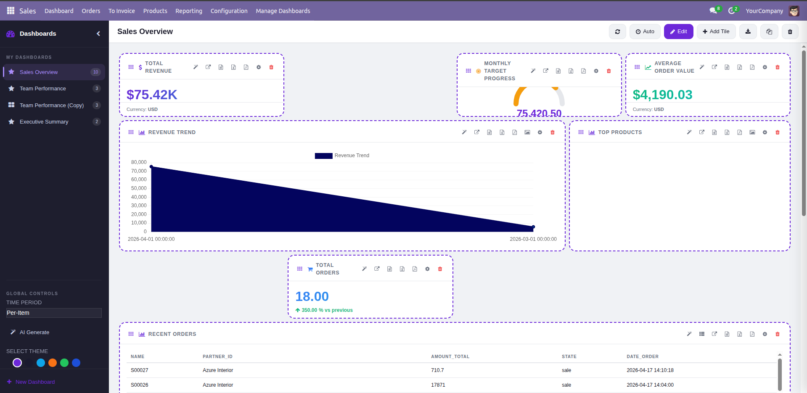
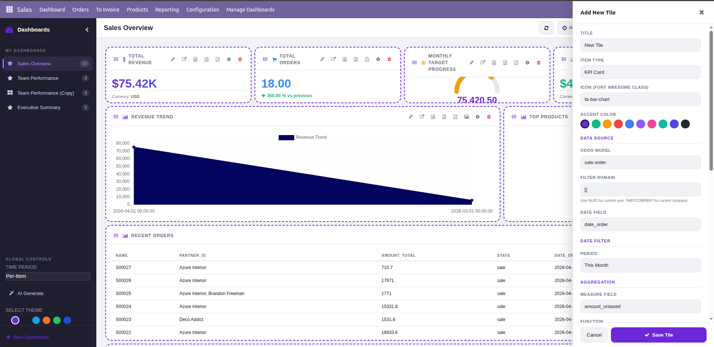
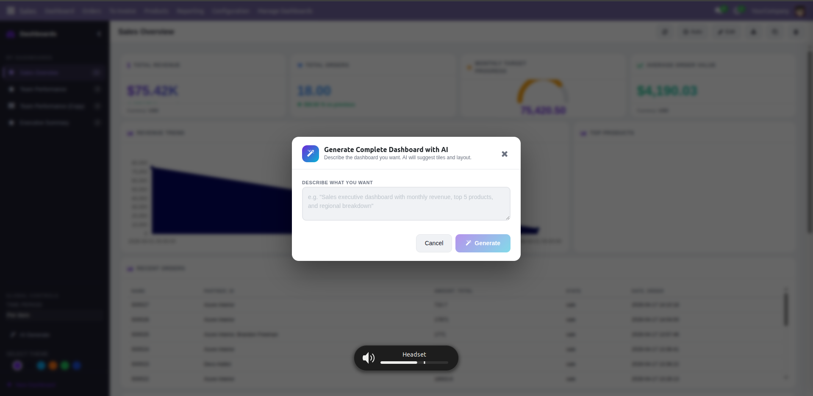

  

<h1 align="center">Advanced Sales Dashboard for Odoo 18</h1>

  <strong>An AI-powered, real-time analytics dashboard with dynamic widgets, GridStack drag-and-drop layout, and multiple themes. Crafted by <a href="https://devscodespace.com">DevsCodespace</a>.</strong>

---

## 🚀 Overview

The **Advanced Sales Dashboard** is a feature-complete analytics module for Odoo 18 designed to give you extreme flexibility and real-time insights into your sales data. Whether you need a high-level executive overview, a localized team performance chart, or AI-driven insights extracted from your KPIs, this dashboard delivers a premium experience natively inside Odoo.

### Key Features
*   ✨ **AI-Powered Insights:** Generate complete dashboards, setup tile configuration with keyword prompts, or extract insights directly from individual charts using Gemini/OpenAI!
*   📱 **Fluid Drag & Drop Layout:** Powered by GridStack.js. Move, resize, and position your components instantly in Edit Mode. Layout personalization is saved securely per-dashboard.
*   🔄 **Real-Time Data Polling:** The Auto-Refresh engine fetches new data and triggers smooth animated chart re-renders natively inside OWL, keeping the screen alive without full page reloads.
*   🎨 **Beautiful Visuals:** Includes 6 predefined UI themes, 7 chart color palettes, native SVG icons, font-awesome integration, and gorgeous glassmorphic/neumorphic tooltips.
*   📈 **Multiple Component Types:** KPI Cards, Line/Bar/Pie Charts, Gauges, Todo Lists, and compact/card Data Tables.
*   ⬇️ **Extensive Export Options:** Download tile data as Excel (`.xlsx`), CSV, PDF, or snapshot charts as PNG directly from the dashboard controls.

---

## 📸 Screenshots

### 1. Main Dashboard View

_The complete high-level overview. Notice the smooth cards, the multiple chart types, and real-time polling indicators in the top header._

### 2. Edit Mode & Layout Management

_Clicking the **Edit** button reveals component gridlines and drag handles. Easily drag the (⠿) handle of any tile to move it, or drag the bottom right corner to resize._

### 3. Adding & Configuring a Tile

_A powerful popup lets you dictate exactly what data the new tile will display. Choose models, fields, aggregation methods, and color palettes._

### 4. AI-Driven Insights

_Select any chart and let the integrated AI engine interpret the data trends, providing plain-text executive summaries._

---

## ⚙️ How to Configure the App

### 1. Installation & Setup
1. Place the `advanced_sales_dashboard` folder into your Odoo 18 `addons` path.
2. Restart your Odoo server.
3. Turn on **Developer Mode** in Odoo.
4. Go to **Apps**, click **Update Apps List**, search for `Advanced Sales Dashboard`, and click **Activate**.
5. **Assign User Permissions:** Navigate to **Settings** ➡️ **Users & Companies** ➡️ **Users**. Select the user you want to grant access to, and under the *Access Rights* tab, set their permission for the `Advanced Sales Dashboard`.

### 2. Accessing the Dashboard
Go to the **Sales** application in the Odoo Top Bar, then click the **Dashboard** menu item.

### 3. Creating and Managing Dashboards
*   **Create New:** Use the sidebar or header controls to create an entirely new dashboard container.
*   **Switching:** Switch between the "Sales Overview", "Team Performance", or newly created boards seamlessly.
*   **Theming:** Click the gear icon or theme dropdown to instantly cycle the dashboard between different built-in themes (e.g., Default, Dark Mode, Elegant).

### 4. Adding & Editing Components
1. Click the **Edit** button in the top right corner. The grid will activate.
2. Click **Add Tile**. A slide-over configurator window will open.
3. **Configuration Options:**
   *   **Item Type:** Select KPI, Chart (Bar, Line, Pie, Doughnut), List, or Gauge.
   *   **Domain & Model:** Pick the base model (e.g., Sales Order) and optionally set domains to filter data.
   *   **Measure & Grouping:** For charts, pick which numeric field to measure (e.g., Total Amount) and which dimension to group by (e.g., Salesperson, Date).
4. Save the tile. The dashboard will instantly fetch its real-time data.
5. While in Edit mode, click and drag the `(⠿)` grip on the top-left of any card to move it around, or use the bottom right corner handle to resize it. GridStack will automatically flow other cards around it.
6. Click **Edit** again to lock the layout and return to view mode.

### 5. Managing Auto-Refresh (Polling)
Click the **Auto** button with the clock icon in the header. If enabled, the dashboard will silently poll the server for fresh data in the background based on the configured polling interval (default 30 seconds). A pulsing "Live" indicator will appear in the top header. Any widget whose data has changed will animate gracefully.

---

> **Brought to you by [DevsCodespace](https://devscodespace.com/)**  
> *Transforming Odoo standard features into modern, beautiful, and intelligent business tools.*
